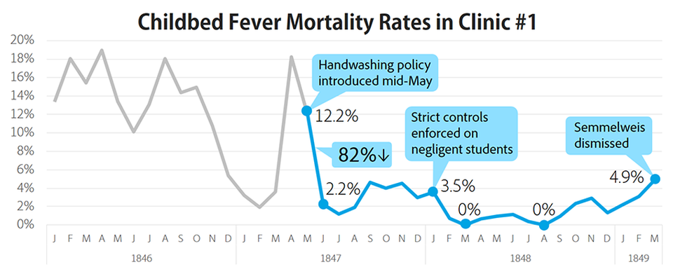

```{r setup, include=FALSE}
knitr::opts_chunk$set(echo = FALSE)
knitr::opts_knit$set(root.dir = './')
source("resources/preamble.R")
```

# Welcome to COM 495/6/7: Turning Data into Insight and Stories


## About Me

<div class='container'>
<div class='col fragment'>

</div>
<div class='col fragment'>

</div>
<div class='col fragment'>

</div>
</div>

## Dad Joke

- Why did the nearsighted man fall in the well?

> - He couldn't see that well!

## Introductions
> - Try breakout rooms
- Name
- Year
- Major
- What you hope to get from this class

# The Class


## Why learn data storytelling skills?


<aside class="notes">
This is Ignaz Semmelweis.

Austrian physician working as an OB in the 1840s.

2 clinics - one run by Drs the other by nurses. Women begged to be admitted to the nurse-run facility.

Childbed fever ran rampant in the Dr clinic - about 10% of women who gave birth there died

Another Dr. in the hospital and Semmelweis's friend Jakob Kolletschka was poked with a scalpel while helping a student perform an autopsy. Semmelweis realized that was the difference - the Drs. performed autopsies, and something from the cadavers was making women sick. He instituted handwashing with chlorinated lime, and deaths plummeted.

He spent the rest of his life trying to convince others of the value of handwashing in increasingly desperate ways and eventually died in an insane asylum.
</aside>


## Lots of reasons Semmelweis's findings were not accepted

> - No real theory of how "corpse particles" actually caused disease
> - Didn't fit in the "paradigm" of understanding
> - Doctors had to accept that they were the cause of thousands of deaths

## But he was also a bad data storyteller


## Data does not speak for itself




<div class='footnote'>Image via [Brent Dykes](https://www.forbes.com/sites/brentdykes/2016/02/09/a-history-lesson-on-the-dangers-of-letting-data-speak-for-itself/?sh=6bbd7d9720e1)</div>

<aside class="notes">

I'm not saying that this class will help you to avoid dying alone, but I'm also not *not* saying that

</aside>

## Goals

> - Understand the role of narrative in interpreting and producing data analyses
> - Competently import, process, and prepare data for analysis in R
> - Produce beautiful, truthful visualizations in R
> - Critically analyze data visualizations and presentations
> - Craft compelling data presentations

## About the class

> - Building a learning community
> - Discussions vs. lectures
> - Resolving confusion
> - Project-based


## Discord Meetings

> - Tuesdays are "required"
> - Thursdays are typically more of a co-working time (but sometimes synchronous)
> - Discussion questions due on Mondays (in Discord)
> - Random cold calling based on questions
>	- I will track whether you are prepared
> - Think, pair, share

## Grading
>- Normal grading has some negative unintended consequences
<div class='container'>
<div class='col'>

</div>
</div>
>- How can we build a learning community?

## Grading
>- I'm interested in teaching, not assessing
> - Goal is to build in assessments that encourage learning and accountability
>- Assignments will be turned in on Brightspace and/or discussed in class
>- I will provide feedback
>- 4 times during the semester you will turn in reflection pieces
>- If I disagree I will reach out

## Dangers of this approach to grading

## Assignments

> - Homework
>	- Programming assignments
>	- Data story projects
> - Reading
> - Participation
>	- In class responses

## R

> - For much of the class, homework will be R assignments instead of discussion questions
> - Tuesday classes will review homework questions and confusions, Thursdays will be co-working
> - Please ask and answer questions in Discord!

## Exam

> - One exam
>	- Goal is to encourage self-accountability

## Final Project

> - Data presentation

## Project Milestones

> - Identify dataset
> - Proposal
> - Rough draft
> - Each stage includes a round of peer feedback


# Resources

## Discord

> - Conversation
> - Class sessions
> - Help
>	- In general, ask publicly so others can answer / see the answer

## Wiki

> - Schedule
> - Links to readings

## Brightspace

> - Readings
> - Submit some assignments

## Office Hours

> - On Discord
>	- 1-to-1 meetings on Friday 10-12
>	- Sign up on the wiki

## Please be vocal
>- I will solicit feedback as part of reflections
>- Let me know what is and isn't working
