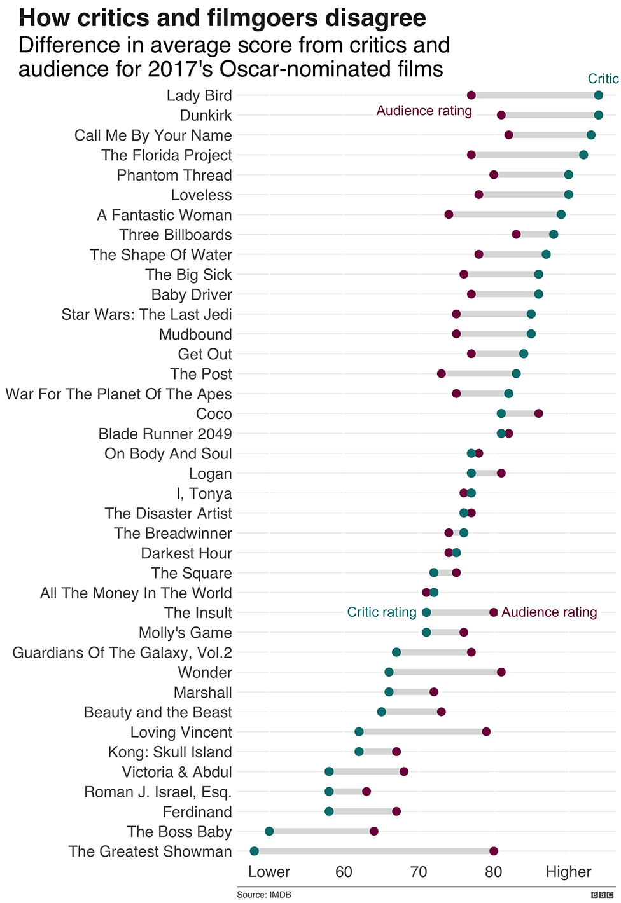

```{r setup, include=FALSE}
knitr::opts_chunk$set(echo = TRUE)
knitr::opts_knit$set(root.dir = './')
source("resources/preamble.R")
```

## Why Programming?

> - Working with data means manipulating it and visualizing it
>	- General programming languages provide the most powerful tools
> - Learning "Computational thinking"
>	- Even if you don't use programming you can learn to think like a computer
>	- Understand what is possible in collaborations with programmers

## Why R?

> - Powerful
> - Common
> - Great support for visualization



# Programming Concepts

## Packages

Run once:
```{r, eval=F}
install.packages('tidyverse')
```

<div class='fragment'>
Run in every file:
```{r, eval=F}
library(tidyverse)
```
</div>


## Functions

> - Packages contain functions, which are loaded when you run `library()`
> - Try running this:

<div class='fragment'>
```{r, eval=F}
sum(1,2,3,4)
```
</div>

> - `sum` is a function that "takes in" a list of numbers as its "parameters" and "returns" their sum
> - You can also write your own functions

<div class='fragment'>
```{r, eval=F}
multiply <- function(a,b){
  return(a * b)
  }
```

## Variables

> - Locations to "save" something

<div class='fragment'>
```{r}
x <- 5
print(x)
```
<div>

## Data frames

> - R's version of spreadsheets

<div class='fragment'>
```{r}
mtcars
```
</div>
